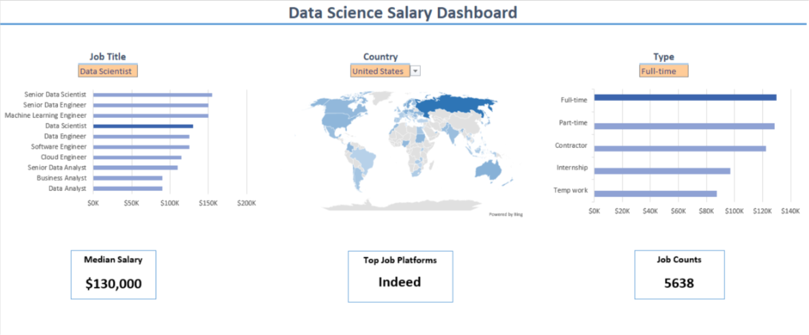
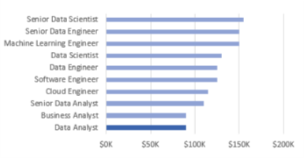

# Excel Salary Dashboard

## Introduction
This data jobs salary dashboard was created to help job seekers investigate salaries for their desired jobs and ensure they are being adequately compensated.

The data is from my Excel course, which provides a foundation in analyzing data using this powerful tool. The data contains detailed information on job titles, salaries, locations, and essential skills that are presented here.

### Dashboard File
My final dashboard is in [Download Salary Dashboard Excel](1_Salary_Dashboard.xlsx)

### Excel Skills Used
The following Excel skills were utilized for analysis:

- 📉 Charts
- 🧮 Formulas and Functions
- ❎ Data Validation
  
### Data Jobs Dataset
The dataset used for this project contains real-world data science job information from 2023. The dataset is available via my Excel course, which provides a foundation for analyzing data using Excel. It includes detailed information on:

- 👨‍💼 Job titles
- 💰 Salaries
- 📍 Locations
- 🛠️ Skills

## Dashboard Build
📉 Charts
📊 Data Science Job Salaries - Bar Chart

